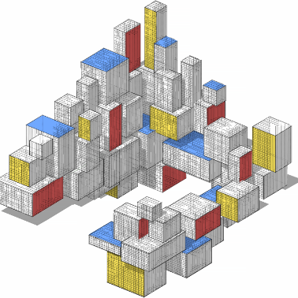

Data Science and Machine Learning
 

Welcome to the GitHub organization for the book  
**_Data Science and Machine Learning: Mathematical and Statistical Methods_**  
by Dirk P. Kroese, Zdravko Botev, Thomas Taimre, and Radislav Vaisman.

# Repositories

## [💻 Programs](https://github.com/DSML-book/Programs) — Python code for the first edition

## [🎓 Lectures](https://github.com/DSML-book/Lectures) - Lecture slides for the first edition

# PDFs

## [📖 Book](https://people.smp.uq.edu.au/DirkKroese/DSML/DSML.pdf) - Complete first edition.

## [🐞 Errata](https://github.com/DSML-book/Errata/blob/master/errata.pdf) - Corrections for the first edition

## [✅ Solutions](https://github.com/DSML-book/Odd-numbered-Solutions/blob/master/solutions_odd.pdf) - Solutions for odd-numbered questions of the first edition
